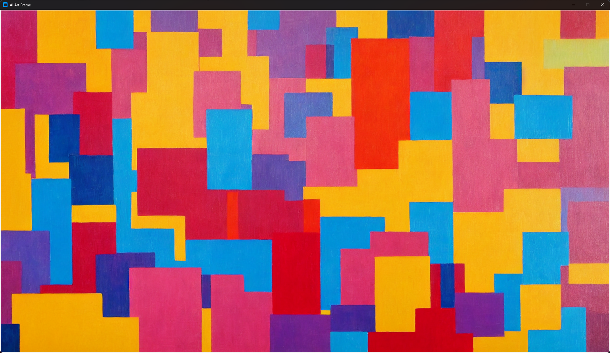
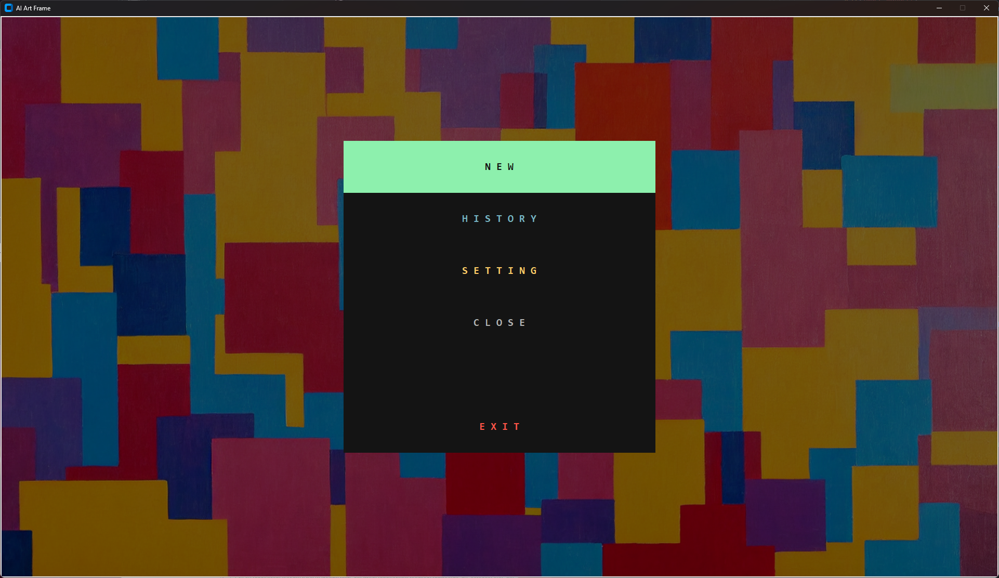
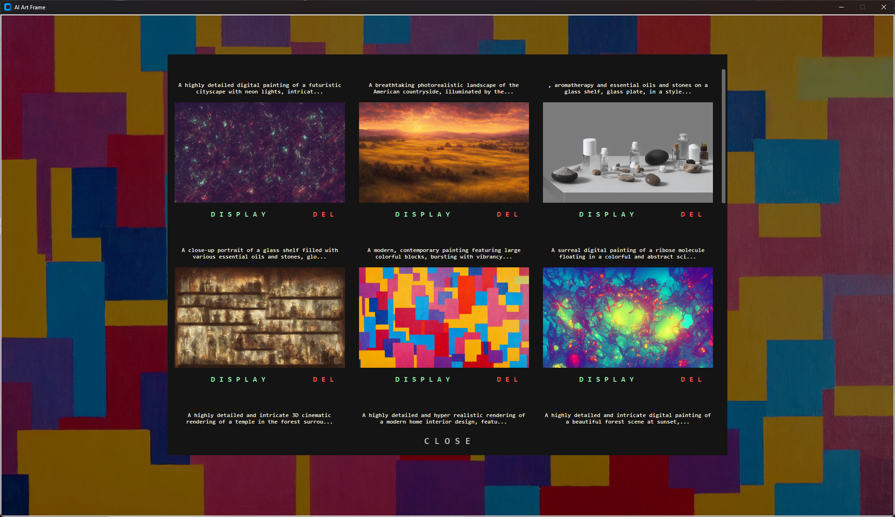

# ai-art-frame

Generate AI art for a wall picture-frame display by voice, powered by OpenAI
**gpt-image-2**. Designed to run fullscreen on a Raspberry Pi — everything is
driven by tapping the screen.

# Setup

This project uses [uv](https://docs.astral.sh/uv/) to manage the Python version and dependencies.

1. **Install uv** (once) — see https://docs.astral.sh/uv/getting-started/installation/
2. **Create the environment.** uv uses the **OS Python** (`python-preference = "only-system"`) and installs the exact versions pinned in `uv.lock`:
   ```sh
   uv sync
   ```
   > The system Python is required because python-build-standalone's bundled Tk crashes on some Linux/X11 setups ([uv#11942](https://github.com/astral-sh/uv/issues/11942)). On Linux/Raspberry Pi, install Tk for the system Python first: `sudo apt install -y python3-tk` (plus `portaudio19-dev libjpeg-dev zlib1g-dev` so PyAudio/Pillow can build).
3. **Add your secret** to the project root (git-ignored):
   - `key.secret` — your OpenAI API key
4. **Run the app:**
   ```sh
   uv run python src/main.py
   ```
   On a PC the frame is fullscreen at 1080×1920, which won't fit a landscape
   monitor. For development, run it as a scaled-down (540×960) movable window:
   ```sh
   uv run python src/main.py --windowed
   ```
   The Raspberry Pi launches without the flag and stays fullscreen.

**Managing dependencies:** `uv add <pkg>` / `uv remove <pkg>` to change them, `uv lock --upgrade` to refresh the lockfile. Commit `pyproject.toml` and `uv.lock`; the `.venv/` folder is git-ignored and recreated by `uv sync`.

# Using the frame

Tap the screen to open the menu:

- **new** — pick a style from the 3×3 grid (**Plain** in the center, plus Realistic Photo, Oil Painting, Watercolor, Anime, Impressionist, Pixel Art, Pop Art, Minimalist), then speak an idea and gpt-image-2 generates an image in that style. **Plain** keeps your words neutral and honors any style you speak. Say `verbose ...` to skip prompt rewriting and use your words directly (the chosen style is not applied in verbose mode); include `... title X` to set the title.
- **upload** — shows this frame's web address and a QR code. Open it on a phone on the same Wi-Fi to send your own images (see below).
- **history** — browse past images; display or delete any of them.
- **setting** — image generation, rotation, and general options.
- **sync** — pull the latest code from GitHub and restart (see below).
- **close / exit** — dismiss the menu / quit the app.

## Image generation settings (setting → Image Generation)

- **quality** — `auto` / `high` / `medium` / `low`.
- **background** — `auto` / `opaque` / `transparent`.

The output **size is locked to `1152x2048`** (the frame's exact 9:16 aspect, and a valid multiple-of-16 size for gpt-image-2), so images fill the 1080×1920 frame with no bars or crop. Images are always stored on disk as PNG.

## Auto-rotation / slideshow (setting → Rotation)

- **Auto Rotate** — turn the slideshow on/off.
- **Rotate Mode** — `sequential` (saved order), `shuffle` (random), or `newest` (recent first).
- **Interval (min)** — minutes between changes.

Rotation pauses automatically while the menu is open or during generation.

## Web upload (drop-in images)

The app runs a small upload server on port **8080**. Tap **upload** to see this
frame's address (e.g. `http://192.168.1.x:8080/`) and a QR code. Open it on a
phone or laptop on the same network, pick one or more images, and they appear in
the gallery right away. The server is LAN-only and unauthenticated — intended
for a home network.

## Sync (update from GitHub)

Tap **sync** to `git pull` the latest code. If dependencies changed (`uv.lock`
differs), it runs `uv sync` first; then the app restarts automatically to load
the new code. Your settings and image history are preserved across the update.

# Runtime data & git

`configs.json` and the frame's runtime images (`imgs/*.png`, `imgs/records.json`)
are device-local state and are **git-ignored**, so the in-app Sync (`git pull`)
never conflicts with them.

**One-time migration on an existing device:** the first sync after adopting this
change de-tracks `configs.json` and `imgs/records.json`. The sync routine
snapshots and restores them automatically, but if a pull is ever blocked by
local changes, run `git stash` once on the device (or re-clone) to get unstuck.

# Screenshots



